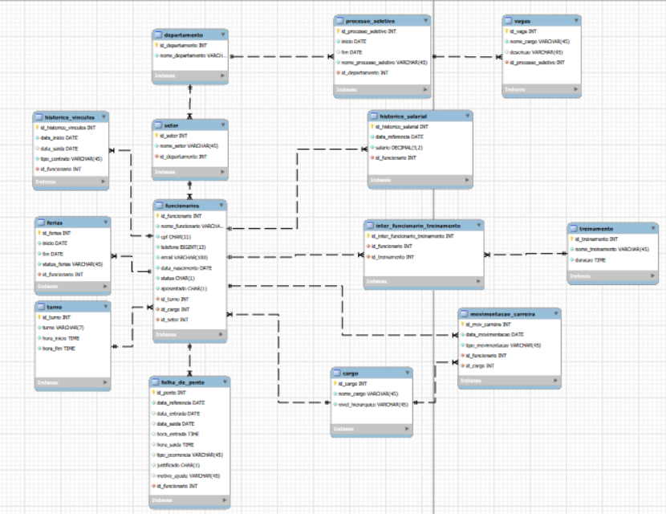

# hr_database

Este repositório contém o projeto de modelação e implementação de um Banco de Dados Relacional voltado para a Gestão de Recursos Humanos (sistema_rh). O projeto foi desenvolvido como requisito prático e avaliativo para a disciplina de Banco de Dados I do curso de Engenharia da Computação da UNIVAP (Universidade do Vale do Paraíba).

## 🗺️ Modelo Entidade-Relacionamento (MER)

O diagrama abaixo ilustra a arquitetura lógica do banco de dados, evidenciando as tabelas, as respetivas chaves primárias (PK), chaves estrangeiras (FK) e a integridade referencial do ecossistema:

## 📂 Arquitetura das Tabelas

O banco de dados é composto por 14 tabelas normalizadas para mitigar redundâncias e inconsistências de dados:

### 🏢 1. Estrutura Organizacional (Tabelas de Domínio)

departamento: Centraliza os setores macro da empresa (ex: TI, Financeiro, Marketing).

setor: Divisões específicas ligadas a cada departamento (relação $1:N$).

cargo: Catálogo de cargos e os respetivos níveis hierárquicos (Operacional, Pleno, Especialista, Gerencial, Diretoria).

turno: Define as escalas de trabalho e horários de entrada e saída.

### 👤 2. Cadastro Geral

funcionarios: Tabela central do sistema, agregando dados pessoais (nome, CPF, telefone, email, status) e chaves estrangeiras para cargo, turno e setor.

### ⏱️ 3. Histórico e Operação Diária

historico_vinculos: Regista os contratos do colaborador ao longo do tempo (CLT, PJ, Temporário, Estágio), permitindo rastrear colaboradores ativos e inativos (data_saida).

historico_salarial: Rastreabilidade temporal da folha de pagamento e evolução salarial de cada colaborador.

movimentacao_carreira: Auditoria completa de eventos de carreira (Admissão, Promoção, Mudança de cargo, Aumento Salarial, Transferência, Desligamento).

folha_de_ponto: Registo diário de ponto, mapeando atrasos, horas extraordinárias, faltas e as respetivas justificações.

ferias: Controlo de períodos de descanso agendados, gozados ou cancelados.

### 🎯 4. Recrutamento e Seleção (R&S)

processo_seletivo: Registo de campanhas de contratação com datas de abertura e encerramento.

vagas: Postos de trabalho abertos atrelados a cada processo seletivo.

### 📚 5. Capacitação e Desenvolvimento

treinamento: Catálogo de cursos e formações disponibilizados pela empresa.

inter_funcionario_treinamento: Tabela associativa ($N:M$) que mapeia quais os funcionários que participaram de cada treinamento.

## 📈 Inteligência de Negócio (People Analytics)

A estrutura lógica do sistema foi concebida para fornecer relatórios gerenciais complexos e automatizados através do uso de Views (Vistas), resolvendo desafios de RH como:

Cálculo Dinâmico de Turnover: Projeção da taxa de rotatividade anual dos últimos 5 anos utilizando a fórmula:

$$\text{Turnover} = \frac{(\text{Admissões} + \text{Desligamentos}) / 2}{\text{Ativos}} \times 100$$

Análise de Absenteísmo Sazonal: Identificação de faltas e atrasos não justificados em feriados prolongados (como o Carnaval).

Equidade e Média Salarial: Cruzamento de médias de remunerações agrupadas por cargo, setor e turno baseadas exclusivamente no último salário vigente.

Planeamento de Escalas: Projeção de ausências programadas por férias num horizonte de 60 dias para evitar furos na operação.

## 🛠️ Tecnologias Utilizadas

SGBD: MySQL Server 8.0

Modelação: MySQL Workbench

Linguagem: SQL (DDL, DML, DQL)

Nota Académica > Instituição: Universidade do Vale do Paraíba (UNIVAP)

Disciplina: Banco de Dados I

Curso: Engenharia da Computação

Ano: 2026